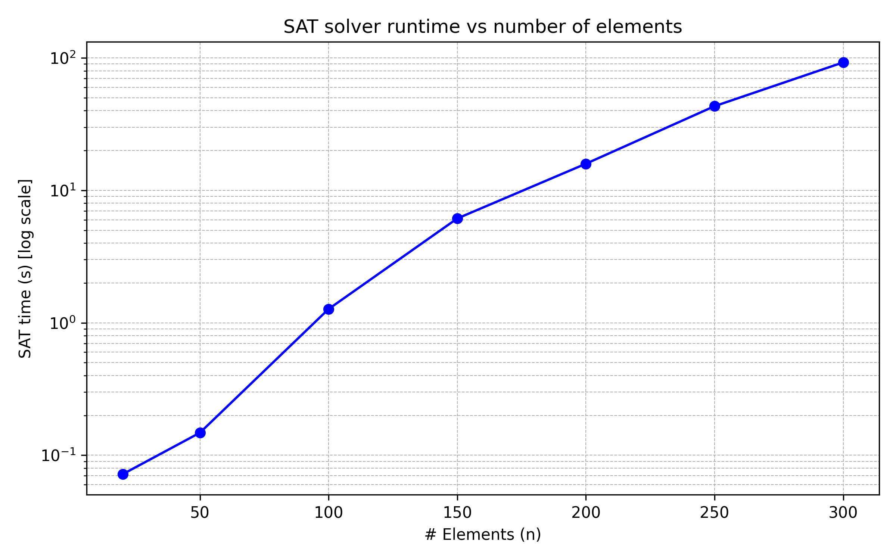

# SAT-ExactCover
## Problem Definition
Let
X = {1, 2, …, n}
and
S = {S₁, S₂, …, Sₘ}
be a collection of subsets of X.

**Decision question:**  
Is there a subcollection S* ⊆ S such that each element in X appears in exactly one subset of S*?
Equivalently, does S* form an exact cover of X?

**Decision output:**  
- SAT if such a selection exists.  
- UNSAT otherwise.

**Input format** 
```
n m
S1
S2
S3
...
Sm

n - number of elements in set X
m - number of subsets in the collection of subsets S
Si - integers representing the elements of subset Si
```
**Example 1 (UNSAT):**
```
4 3
1 2
2 3
3 4
```
Decision output: UNSAT

**Example 2 (SAT):**
```
3 3
1
2 
3
```
Decision output: SAT

## Encoding

The problem is encoded using variables $s_i$ that indicate whether we select the subset $S_i$.  

For each element $x \in X$, define  

I(x) = { i ∣ x ∈ Sᵢ }

We require that each element $x \in X$ is covered exactly once:

1. **At least one subset covers x**:
     
$$\bigvee_{j \in I(x)} s_j$$

2. **At most one subset covers x**:
     
$$\neg s_j \vee \neg s_k \quad \text{for all } j \neq k \text{ in } I(x)$$

## User documentation
### Basic usage:
```
exact_cover_sat.py [-h] [-i INPUT] [-o OUTPUT] [-s SOLVER] [-v {0,1}]
```
### Command-line options:
- -h, --help: Show a help message and exit
- -i INPUT, --input INPUT: The instance file.
- -o OUTPUT, --output OUTPUT: Output file for the DIMACS format.
- -s SOLVER, --solver SOLVER: The SAT solver to be used.
- -v {0,1}, --verb {0,1}: Verbosity of the SAT solver.

## Example instances
- easy_instance_sat.in: An easy, solvable instance
- easy_instance_unsat.in: An easy, unsolvable instance
- complex_instance_sat.in  A solvable instance that takes approximately 15s to solve.

## Experiments
Experiments were tun on Intel Core i7-12700H (2.3Hz) and 16 GB RAM on Ubuntu inside WSL2 (Windows 11).
Time was measured with hyperfine.

We measured how long the SAT solver takes depending on the number of elements n, given that:

- The number of subsets is 5 × n.

- Each subset has a size between n / 20 and n / 5.

The goal is to observe how runtime scales with the number of elements under these constraints.

| # Elements (n) | SAT time (s) |
|----------------|--------------|
| 20             | 0.072        |
| 50             | 0.148        |
| 100            | 1.271        |
| 150            | 6.134        |
| 200            | 15.888       |
| 250            | 43.226       |
| 300            | 92.528       |


